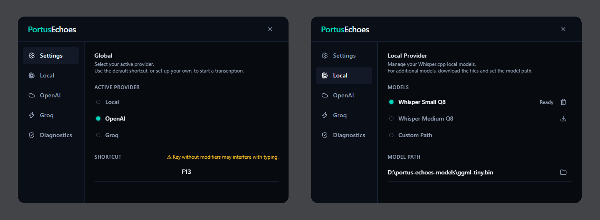
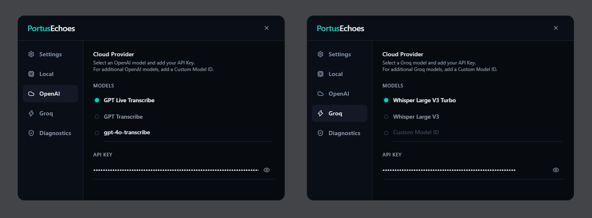
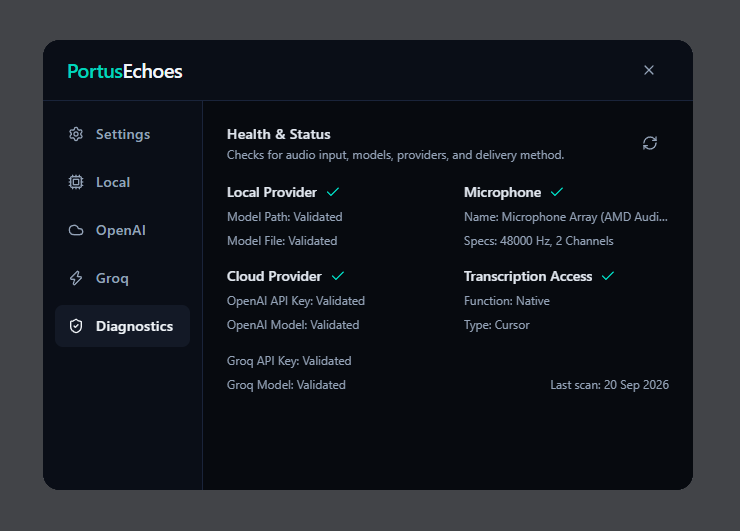

# PortusEchoes

Hold-to-talk speech transcription at your cursor. Transcribe locally on your device with GPU acceleration or through cloud transcription providers. For Windows and Linux.

---

## How It Works

PortusEchoes lives in your system tray and works across every application on your desktop:

- **Hover and speak (Windows):** Put your mouse pointer over any text box, editor, or chat app without clicking. Hold your shortcut key (`Ctrl+Alt+Space` by default) and speak naturally.
- **Direct typing:** On Windows, text is typed directly without touching your clipboard:
  - **OpenAI Live:** BYOK Realtime streaming transcription. Words stream out in real time while you speak, typing into each window as your cursor moves over it.
  - **Groq:** BYOK cloud transcription. Audio is processed after release and the full transcript is typed into the window under your mouse.
  - **Local Whisper:** Fully offline using Whisper. Transcribed locally and typed into the window under your mouse as each segment completes.
- **Clipboard delivery on Linux:** Linux currently uses clipboard delivery across all providers and models. Your completed transcript is automatically copied to your clipboard. The overlay indicator will let you know when the text is ready to paste (`Ctrl+V`) into any target window.
- **Push-to-Talk Indicator:** A small, borderless, click-through overlay pill at the bottom of your screen shows real-time recording and transcription status.
- **Sustained Dictation:** Dictate uninterrupted for a quick phrase or for up to 30 minutes across all modes and models without artificial time limits or mid-sentence drops. Developers compiling from source can expand this limit even further.
- **Full control:** Rebind your shortcut to any key combination, switch between local offline models and cloud providers, or control recordings from the system tray menu.

---

## Additional Features

- **Hardware Acceleration:** Automatic GPU acceleration with multi-threaded CPU fallback.
- **Security & Privacy:** API keys persist exclusively in OS-native secure storage (Windows Credential Manager / Linux Secret Service). No audio is written to disk.
- **Cross-Platform:** Windows and Linux support.
---

## Installation & Releases

Pre-built releases for Windows and Linux are available under [GitHub Releases](https://github.com/PerceivingAI/portus-echoes/releases).

### Windows
1. Download `PortusEchoes_<version>_x64-setup.exe` from the latest release.
2. Run the installer and follow the setup wizard. 
3. Once installed, PortusEchoes will launch and sit in your system tray.

### Linux
Choose the package format best suited for your distribution:
- **AppImage (Universal standalone):**
  1. Download `portus-echoes_<version>_amd64.AppImage`.
  2. Make it executable:
     ```bash
     chmod +x portus-echoes_*.AppImage
     ```
  3. Run it directly:
     ```bash
     ./portus-echoes_*.AppImage
     ```
- **Debian / Ubuntu Package (`.deb`):**
  1. Download `portus-echoes_<version>_amd64.deb`.
  2. Install it with `dpkg`:
     ```bash
     sudo dpkg -i portus-echoes_*_amd64.deb
     ```
  3. Launch PortusEchoes from your application menu or terminal.

---

## Configuration & Settings Guide

Access the Settings window from the system tray icon or during initial onboarding to configure providers, models, and shortcuts.

### 1. Active Provider & Shortcut
- In the **Settings** tab under **Active Provider**, select between **Local**, **OpenAI**, or **Groq**. (You can also toggle active providers directly from the system tray menu).
- Under **Shortcut**, click the input box and press any key combination to rebind your push-to-talk shortcut.

### 2. Local Whisper Models
- **Standard Models:** In the **Local** tab, click the download icon next to a listed model. The file will download directly into your local application data directory.
- **Custom Models:** You can use any Whisper GGML model by downloading the `.bin` file from the official Hugging Face repository:
  **[https://huggingface.co/ggerganov/whisper.cpp/tree/main](https://huggingface.co/ggerganov/whisper.cpp/tree/main)**
  Select **Custom Path** in the Local tab and browse to your downloaded `.bin` file.



### 3. OpenAI Setup
- In the **OpenAI** tab, enter your API key (stored securely in your OS credential store).
- Select a standard model slot (`GPT Live Transcribe` or `GPT Transcribe`), or select **Custom Model ID** and enter any compatible model (e.g. `gpt-4o-transcribe`, `gpt-4o-mini-transcribe`).

### 4. Groq Setup
- In the **Groq** tab, enter your Groq API key.
- Select a standard model (`Whisper Large V3 Turbo`) or select **Custom Model ID** and enter a custom Groq model ID.



### 5. System Diagnostics
Run full end-to-end diagnostics at any time from the tray menu or Settings window to verify microphone input streams, global keyboard shortcuts, and provider reachability:



---

## Choose Your Provider

Every provider in PortusEchoes is completely independent. You only need to configure what you want to use:

- **Offline Local Only:** Transcribe privately on your device using GPU or CPU. Never requires an API key or an internet connection.
- **Groq Only:** For fast transcriptions without having to manage local models. Just add a Groq API key and transcribe!
- **OpenAI Only:** Connect your OpenAI API key for real-time live streaming or high accuracy cloud models.

---

## Platform Support & Delivery

| Capability | Windows | Linux |
|---|---|---|
| **Audio Capture** | WASAPI | ALSA / PipeWire |
| **Local Inference** | GPU / CPU | GPU / CPU |
| **Voice Activity Detection** | Integrated Silero VAD | Integrated Silero VAD |
| **Text Delivery** | Direct Caret Injection | Clipboard Delivery |

*For complete platform details and upcoming Linux caret injection work, see [docs/PLATFORM_MATRIX.md](docs/PLATFORM_MATRIX.md).*

---

## Building from Source (Quickstart)

### Prerequisites

- **Node.js:** 18+ and `npm`
- **Rust:** 1.88+ and `cargo`
- **CMake:** 3.16+
- **C/C++ Compiler:** MSVC (Windows) or GCC/Clang (Linux)

#### Linux System Packages

```bash
# Arch Linux
sudo pacman -S alsa-lib pipewire vulkan-loader libx11 libxtst libxkbcommon

# Ubuntu / Debian
sudo apt-get install libasound2-dev libvulkan-dev libx11-dev libxtst-dev libxkbcommon-dev

# Fedora
sudo dnf install alsa-lib-devel vulkan-loader-devel libX11-devel libXtst-devel libxkbcommon-devel
```

### Setup & Run

1. Clone the repository and configure the environment:
   ```bash
   cp .env.example .env
   ```

2. Install dependencies:
   ```bash
   npm install
   ```

3. Launch development mode:
   ```bash
   npm run tauri dev
   ```

4. Build for production:
   ```bash
   npm run tauri build
   ```

---

## Documentation

- [Architecture Overview](docs/ARCHITECTURE.md)
- [Platform Matrix](docs/PLATFORM_MATRIX.md)
- [Local Inference](docs/LOCAL_INFERENCE.md)
- [Cloud Providers](docs/CLOUD_PROVIDERS.md)
- [Audio Pipeline](docs/AUDIO_PIPELINE.md)
- [Shortcuts & Overlay](docs/SHORTCUTS_AND_OVERLAY.md)
- [Build & Packaging](docs/BUILD_AND_PACKAGING.md)
- [Third-Party Licenses & Attributions](docs/THIRD_PARTY.md)

---

## License

PortusEchoes is licensed under the [Apache License, Version 2.0](LICENSE).
